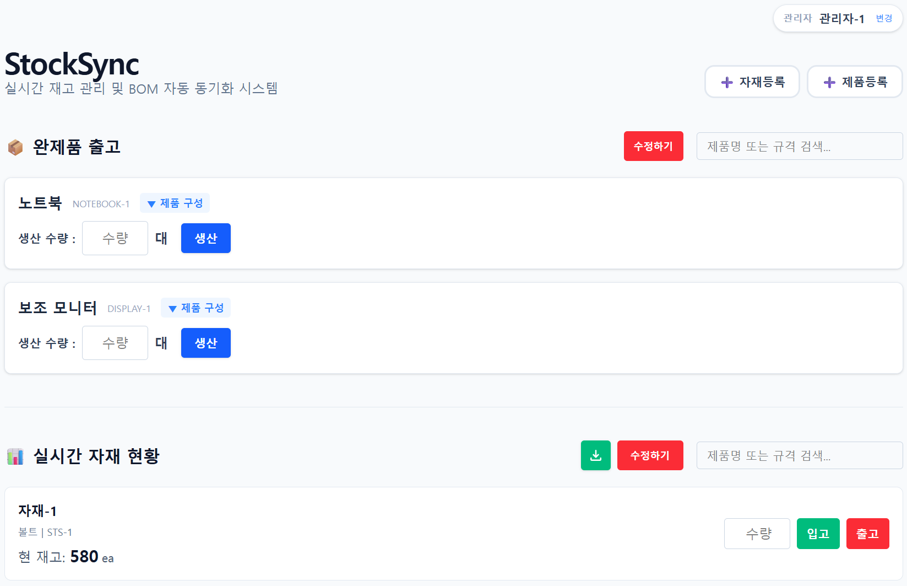

# 📦 StockSync (실시간 재고 관리 시스템)

> **8년의 현장 관리 노하우를 담아, 수동 재고 관리의 병목을 실시간 데이터 기술로 해결한 제조 최적화 솔루션**
>
> 🔗 [StockSync 바로가기](https://stock-sync-umber.vercel.app// "StockSync")

---

## 🌟 프로젝트 소개 (Project Overview)

**StockSync**는 8년 동안 제조 현장에서 재고 때문에 머리 싸매며 고민했던 경험을 바탕으로 직접 기획하고 개발한 프로젝트입니다.

엑셀로 관리할 때 가장 답답했던 **'데이터 누락'**과 **'수기 입력 실수'**를 잡기 위해, 현장(모바일)과 사무실(PC)이 실시간으로 동기화되는 환경을 구축했습니다. 단순히 화면을 만드는 것을 넘어, 실제 비즈니스의 병목을 기술로 해결하는 데 집중했습니다.

---

## 🚀 주요 기능 (Key Features)

- **실시간 데이터 동기화** : `Supabase Realtime`을 통해 현장 입력 즉시 전 기기의 재고 현황이 0.1초 내외로 자동 업데이트됩니다.
- **BOM 자동 차감 엔진** : 완제품 생산 시 설정된 배합 비율에 따라 하위 자재들의 재고가 한꺼번에 차감되는 자동 로직을 구현했습니다.
- **2단 반응형 대시보드** : `Tailwind CSS`를 활용해 현장(입력 위주)과 사무실(모니터링 위주)에 최적화된 기기별 맞춤 레이아웃을 제공합니다.
- **스마트 입력 UX** : 숫자 입력 시 초기값 `0` 제거, 담당자 세션 유지 등 실제 작업자의 피로도를 낮추는 디테일을 적용했습니다.

---

## 🛠 기술 스택 (Tech Stack)

### 💻 개발 환경 (Development)

- **언어 :** `TypeScript`
- **라이브러리 :** `React`
- **상태 관리 :** `Zustand`
- **스타일링 :** `Tailwind CSS`

### ⚙️ 도구 및 배포 (Tools & Deployment)

- **DB & Realtime :** `Supabase`
- **버전 관리 :** `Git`, `GitHub`
- **배포 :** `Vercel`

---

## 📂 프로젝트 구조 (Project Structure)

```text
src/
 ┣ 📂 components   # 공통 컴포넌트 (InventoryList, StockLogs, Search 등)
 ┣ 📂 stores       # Zustand를 활용한 전역 상태 및 데이터 로직 관리
 ┣ 📂 hooks        # 실시간 데이터 구독 및 비즈니스 로직 커스텀 훅
 ┣ 📂 types        # TypeScript 인터페이스 및 타입 정의
 ┣ 📂 util         # 공통 함수 및 날짜 포맷팅 로직
 ┣ 📜 App.tsx      # 메인 대시보드 레이아웃 및 실시간 채널 설정
 ┗ 📜 supabaseClient.ts # 백엔드 연동 및 API 설정
```

---

## 💻 실행 방법 (Getting Started)

### 저장소 클론 (Clone)

```

git clone https://github.com/2JoongHo/Stock_Sync.git

```

### 의존성 설치 (Install)

```

npm install

```

### 환경 변수 설정 (.env)

```

VITE_SUPABASE_URL=YOUR_SUPABASE_URL
VITE_SUPABASE_ANON_KEY=YOUR_SUPABASE_ANON_KEY

```

### 로컬 실행 (Run)

```

npm run dev

```
